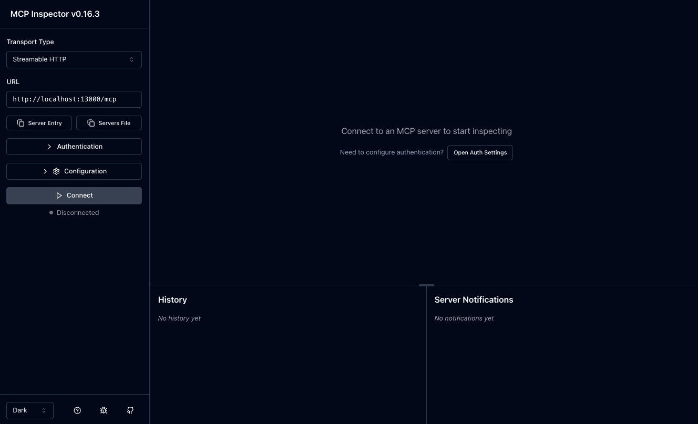
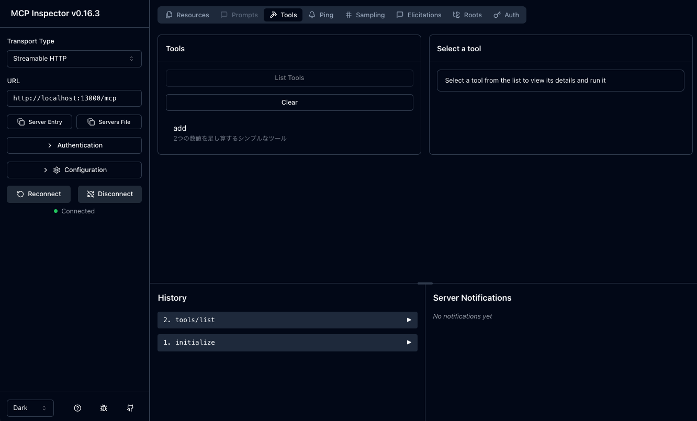

# 足し算をするだけの単純な MCP Server (Streamable HTTP)

このプロジェクトは、足し算をするだけの単純な MCP Server (Streamable HTTP) を実装したものです。

## 機能

- `add` ツールを提供し、2 つの数値を受け取り、その和を返します。
- 最新の計算結果を提供する `last-calculation` リソースを提供します。
- Streamable HTTP 形式の MCP Server として実装されています。
- Express.js を使用して HTTP サーバーを立ち上げます。

## 使い方

### 依存関係のインストール

```bash
npm install
```

### ビルド

```bash
npm run build
```

### 実行

```bash
npm start
```

サーバーは 13000 番ポートでリッスンします。

## API の使用方法

### 初期化

```bash
curl -X POST http://localhost:13000/mcp \
  -H "Content-Type: application/json" \
  -H "Accept: application/json, text/event-stream" \
  -d '{
    "jsonrpc": "2.0",
    "method": "initialize",
    "params": {
      "protocolVersion": "2025-03-26",
      "clientInfo": {
        "name": "curl-client",
        "version": "1.0.0"
      },
      "capabilities": {}
    },
    "id": 1
  }'
```

レスポンスヘッダーの `mcp-session-id` からセッション ID を取得し、以降のリクエストで使用します。

```bash
# 初期化リクエストを送信し、レスポンスヘッダーからセッション ID を取得する例
SESSION_ID=$(curl -X POST http://localhost:13000/mcp \
  -H "Content-Type: application/json" \
  -H "Accept: application/json, text/event-stream" \
  -d '{
    "jsonrpc": "2.0",
    "method": "initialize",
    "params": {
      "protocolVersion": "2025-03-26",
      "clientInfo": {
        "name": "curl-client",
        "version": "1.0.0"
      },
      "capabilities": {}
    },
    "id": 1
  }' -i | grep -i mcp-session-id | cut -d' ' -f2 | tr -d '\r')

echo "セッション ID: $SESSION_ID"
```

### ツール一覧の取得

```bash
curl -X POST http://localhost:13000/mcp \
  -H "Content-Type: application/json" \
  -H "Accept: application/json, text/event-stream" \
  -H "Mcp-Session-Id: $SESSION_ID" \
  -H "Mcp-Protocol-Version: 2025-03-26" \
  -d '{
    "jsonrpc": "2.0",
    "method": "tools/list",
    "id": 2
  }'
```

### 足し算ツールの使用

```bash
curl -X POST http://localhost:13000/mcp \
  -H "Content-Type: application/json" \
  -H "Accept: application/json, text/event-stream" \
  -H "Mcp-Session-Id: $SESSION_ID" \
  -H "Mcp-Protocol-Version: 2025-03-26" \
  -d '{
    "jsonrpc": "2.0",
    "method": "tools/call",
    "params": {
      "name": "add",
      "arguments": {
        "a": 5,
        "b": 3
      }
    },
    "id": 3
  }'
```

### リソース一覧の取得

```bash
curl -X POST http://localhost:13000/mcp \
  -H "Content-Type: application/json" \
  -H "Accept: application/json, text/event-stream" \
  -H "Mcp-Session-Id: $SESSION_ID" \
  -H "Mcp-Protocol-Version: 2025-03-26" \
  -d '{
    "jsonrpc": "2.0",
    "method": "resources/list",
    "id": 4
  }'
```

### 最新の計算結果リソースの読み取り

```bash
curl -X POST http://localhost:13000/mcp \
  -H "Content-Type: application/json" \
  -H "Accept: application/json, text/event-stream" \
  -H "Mcp-Session-Id: $SESSION_ID" \
  -H "Mcp-Protocol-Version: 2025-03-26" \
  -d '{
    "jsonrpc": "2.0",
    "method": "resources/read",
    "params": {
      "uri": "https://example.com/calculations/last"
    },
    "id": 5
  }'
```

### SSE ストリームの確立

```bash
curl -N -X GET http://localhost:13000/mcp \
  -H "Accept: text/event-stream" \
  -H "Mcp-Session-Id: $SESSION_ID" \
  -H "Mcp-Protocol-Version: 2025-03-26"
```

### セッションの終了

```bash
curl -X DELETE http://localhost:13000/mcp \
  -H "Mcp-Session-Id: $SESSION_ID" \
  -H "Mcp-Protocol-Version: 2025-03-26"
```

## MCP Inspector

[MCP Inspector](https://github.com/modelcontextprotocol/inspector) は [Model Context Protocol](https://modelcontextprotocol.io) 公式のリポジトリで提供される MCP Server のテストとデバッグを行うための開発ツールです。CVE-2025-49596 (CVSS Score 9.4) の報告があったこともあり、セキュリティ脆弱性が多く含まれていることを想定して必ず機密性の高いデータが存在しない開発環境で検証を行ってください。

上記の手順で MCP Server を立ち上げた状態で以下のコマンドで MCP Inspector を起動してください。

> MCP Inspector は `6274, 6277` ポートを利用するため Amazon Elastic Compute Cloud (Amazon EC2) インスタンスで Port forward 等を利用してローカルから接続している場合には 2 つのポート転送が必要なことに注意してください。

```bash
npx @modelcontextprotocol/inspector
```




