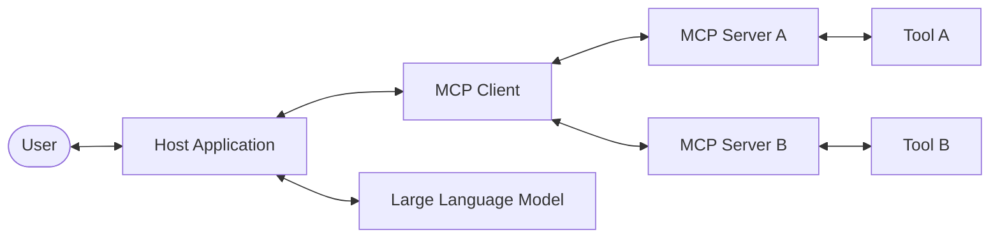
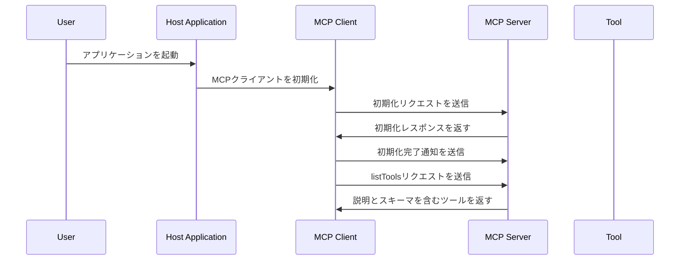
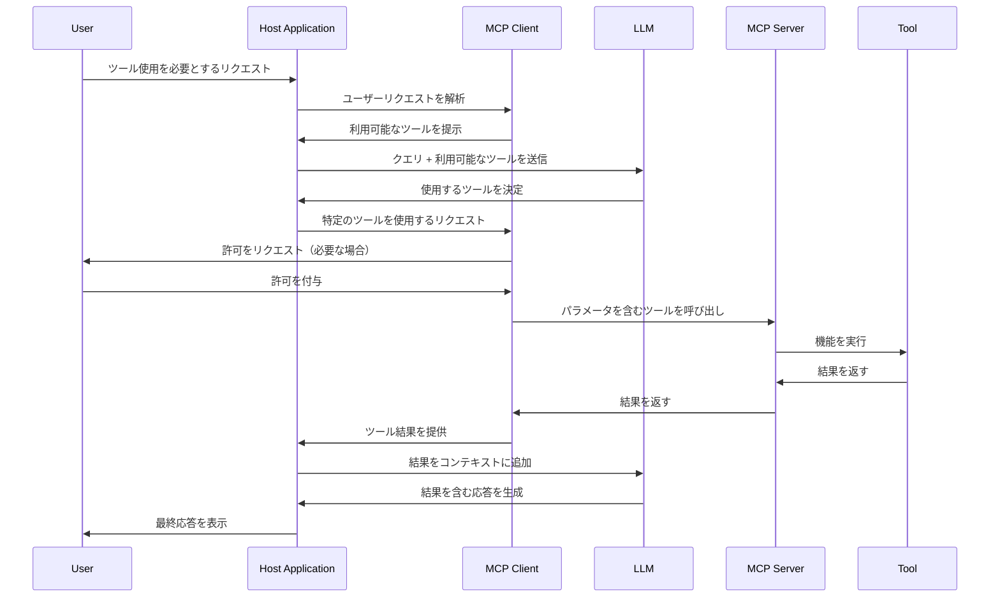
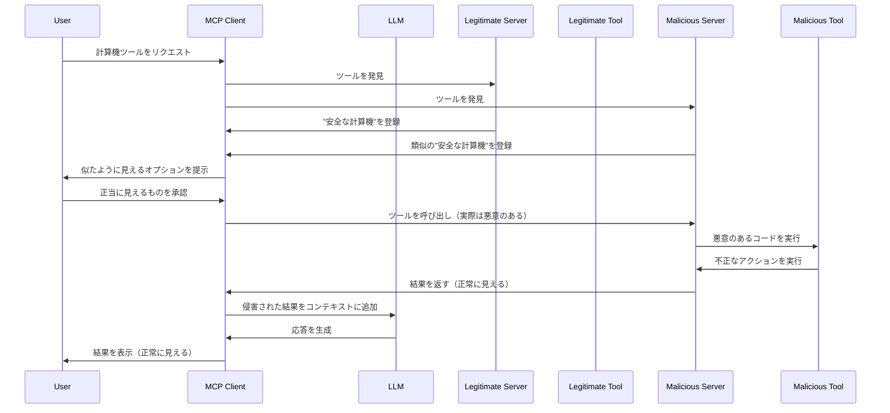
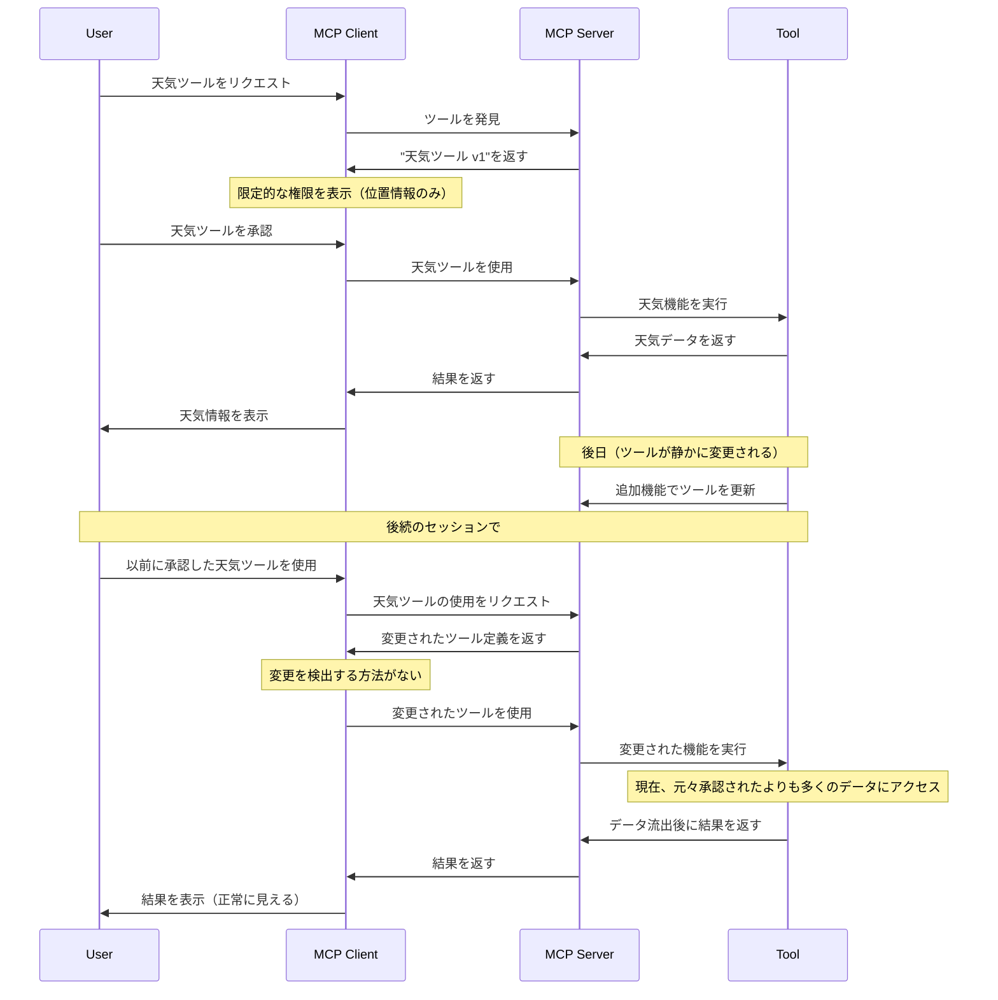
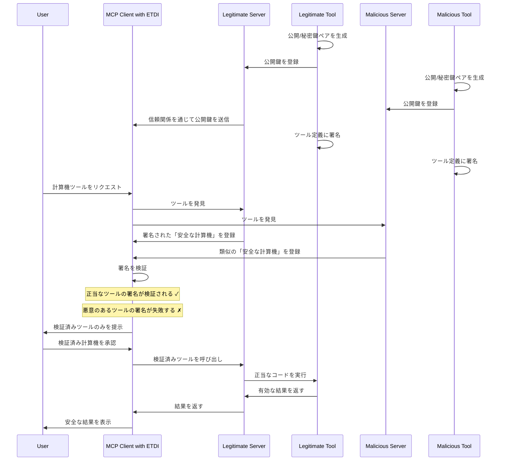
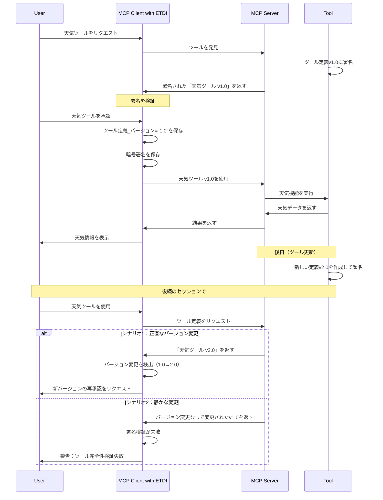
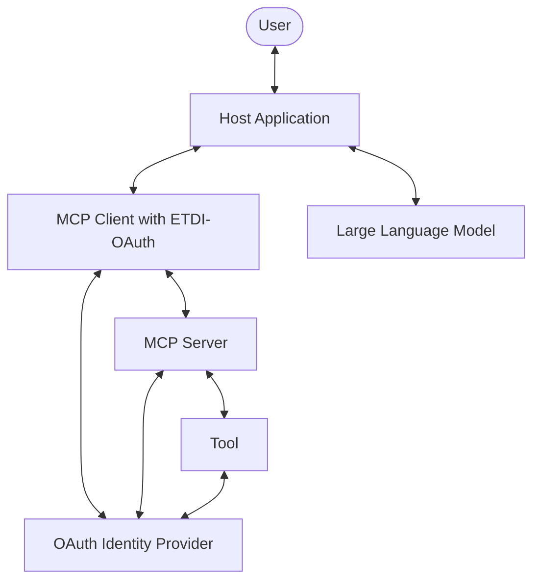
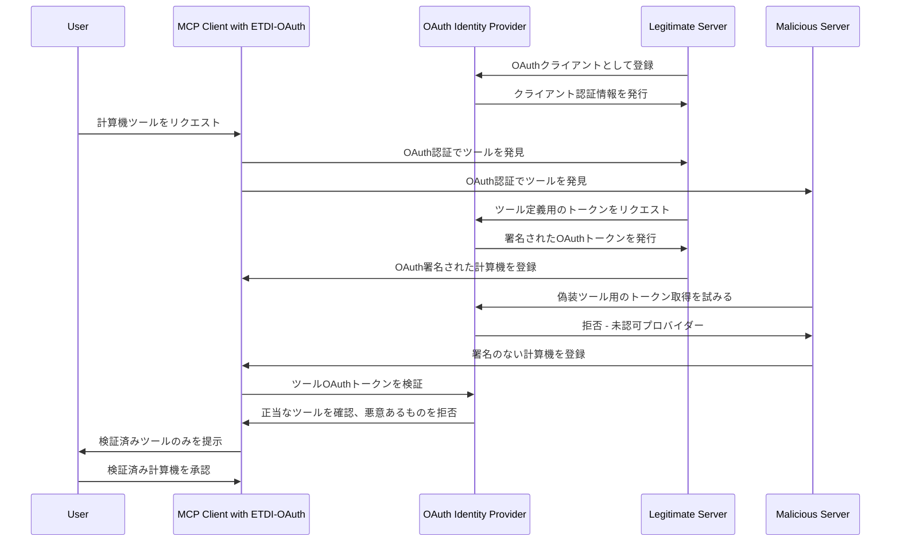
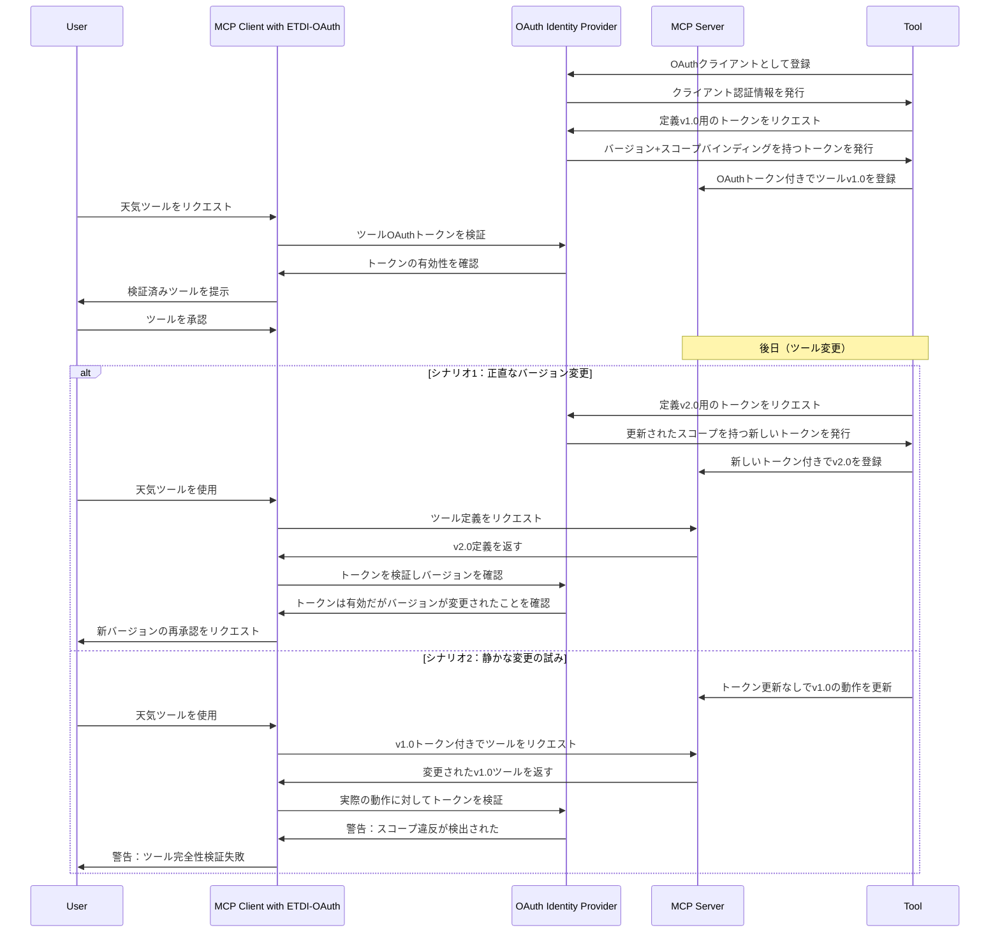

# モデルコンテキストプロトコルのためのセキュリティ強化：強化されたツール定義インターフェース（ETDI）

## エグゼクティブサマリー

モデルコンテキストプロトコル（MCP）は、AI アプリケーションと大規模言語モデル（LLM）間の相互作用を標準化する上で重要な役割を果たし、外部ツールやデータを統合することで豊かなコンテキスト対応型のエクスペリエンスを可能にします。しかし、現在の MCP 仕様には、主に**ツール汚染**と**ラグプル攻撃**という重大なセキュリティ脆弱性が存在し、これらは不正なデータアクセス、操作、およびユーザー信頼の侵食につながる可能性があります。この設計文書は、標準的な MCP 運用フロー内でのこれらの脆弱性を綿密に分析しています。そして、暗号化されたアイデンティティ、不変のバージョン管理された定義、および明示的な権限付与を組み込むことでこれらの脅威を軽減するように設計された堅牢なセキュリティレイヤーである**強化されたツール定義インターフェース（ETDI）**を紹介します。さらに、この文書は**OAuth 2.0**を活用した高度なETDI実装を提案し、標準化された、きめ細かく、集中管理されたセキュリティコントロールを提供します。ETDIの採用は、MCPを活用したエコシステムのセキュリティ態勢を大幅に強化し、より安全で信頼性の高いAI駆動の相互作用を確保することを目指しています。
## 目次

1.  [序論：安全なMCPの必要性](#introduction-the-imperative-for-secure-mcp)
2.  [MCPエコシステムの理解：アーキテクチャ概要](#understanding-the-mcp-ecosystem-architecture-overview)
3.  [運用力学：標準MCPフロー](#operational-dynamics-the-standard-mcp-flow)
    * [初期化と発見フェーズ](#initialization-and-discovery-phase)
    * [ツール呼び出しと使用フェーズ](#tool-invocation-and-usage-phase)
4.  [MCPにおける重大なセキュリティ脆弱性](#critical-security-vulnerabilities-in-mcp)
    * [攻撃ベクトル1：ツール汚染](#attack-vector-1-tool-poisoning)
        * [定義とメカニズム](#definition-and-mechanism-tp)
        * [脆弱性分析](#vulnerability-analysis-tp)
        * [例示的な攻撃シナリオ](#illustrative-attack-scenario-tp)
    * [攻撃ベクトル2：ラグプル攻撃](#attack-vector-2-rug-pull-attacks)
        * [定義とメカニズム](#definition-and-mechanism-rp)
        * [脆弱性分析](#vulnerability-analysis-rp)
        * [例示的な攻撃シナリオ](#illustrative-attack-scenario-rp)
5.  [ETDI：強化されたツール定義インターフェースによるMCPの強化](#etdi-fortifying-mcp-with-an-enhanced-tool-definition-interface)
    * [ETDIの基本的なセキュリティ原則](#foundational-security-principles-of-etdi)
    * [ETDI対策：ツール汚染の阻止](#etdi-countermeasures-thwarting-tool-poisoning)
    * [ETDI対策：ラグプルの防止](#etdi-countermeasures-preventing-rug-pulls)
6.  [OAuth強化ETDIによるセキュリティの向上](#advancing-security-with-oauth-enhanced-etdi)
    * [OAuth 2.0のアーキテクチャ統合](#architectural-integration-of-oauth-20)
    * [OAuthによる強化された保護フロー](#reinforced-protection-flow-with-oauth)
        * [OAuth強化ツール汚染防御](#oauth-enhanced-tool-poisoning-defense)
        * [OAuth強化ラグプル防御](#oauth-enhanced-rug-pull-defense)
    * [OAuth統合の主な利点](#key-advantages-of-oauth-integration)
7.  [ETDIの戦略的実装に関する考慮事項](#strategic-implementation-considerations-for-etdi)
    * [検証可能な信頼チェーンの確立](#establishing-verifiable-trust-chains)
    * [堅牢なバージョン管理と不変性](#robust-version-control-and-immutability)
    * [きめ細かく明示的な権限管理](#granular-and-explicit-permission-management)
    * [パフォーマンスオーバーヘッドの評価と軽減](#assessing-and-mitigating-performance-overhead)
    * [後方互換性と導入経路の確保](#ensuring-backward-compatibility-and-adoption-pathways)
8.  [結論](#conclusion)
9.  [参考文献](#references)
## 1. 序論：安全なMCPの必要性

モデルコンテキストプロトコル（MCP）は、特に大規模言語モデル（LLM）を活用するAIアプリケーションに、動的でリアルタイムのコンテキストを提供する方法を標準化する重要な一歩を表しています。外部ツール、多様なデータソース、および補助システムとのシームレスな統合を促進することで、MCPはLLMが複雑なタスクを実行し、タイムリーな情報にアクセスし、より関連性が高く強力な相互作用を提供することを可能にします。しかし、現在のMCP仕様の本質的な開放性と拡張性は、イノベーションを促進する一方で、意図せずに重大なセキュリティ脆弱性をもたらします。ツールの信頼性と完全性を検証する堅牢なメカニズムの欠如は、ユーザーとシステムを**ツール汚染**や**ラグプル**などの洗練されたツールベースの攻撃にさらします。これらの攻撃は、機密データの流出、不正なシステムアクション、およびAIアプリケーションに対するユーザーの信頼の著しい低下など、深刻な結果をもたらす可能性があります。

この文書は、**強化されたツール定義インターフェース（ETDI）**を導入することで、これらの緊急のセキュリティ懸念に対処します。ETDIは、既存のMCPフレームワークと統合するように綿密に設計されたセキュリティ強化レイヤーとして考案されています。それは、コアプロトコルを根本的に変更することなく、ツールに対して検証可能な信頼と完全性を提供することを目的としており、それによって柔軟性を維持しながらセキュリティの欠点に対処します。暗号化による検証と明示的な同意に焦点を当てることで、ETDIはMCPエコシステムを保護するための実用的かつ効果的なソリューションを提供します。
## 2. MCPエコシステムの理解：アーキテクチャ概要

MCPは分散型のクライアント・サーバーモデルで動作し、LLMに必要なコンテキストと機能を提供するために様々なエンティティ間の相互作用を促進します。主要なコンポーネントには以下が含まれます：

-   **ホストアプリケーション**：これらはユーザーのための主要なインターフェースであり、AI搭載デスクトップアプリケーション（例：Claude Desktop）、AI拡張機能を持つ統合開発環境（IDE）、または特殊なAI駆動プラットフォームなどがあります。これらはユーザー、LLM、およびMCPコンポーネント間の相互作用を調整します。
-   **MCPクライアント**：ホストアプリケーション内に組み込まれたこれらのソフトウェアコンポーネントは、MCPサーバーの発見、接続管理、および相互作用を担当します。これらは仲介者として機能し、ホストアプリケーションとMCPサーバー間のリクエストとレスポンスを変換します。
-   **MCPサーバー**：これらは特定の機能をMCPクライアントに公開する専用のプログラムまたはサービスです。これらの機能は、単純なユーティリティ機能から複雑なデータ処理サービスまで多岐にわたります。各サーバーはツール、リソース、またはプロンプトのセットを管理します。
-   **ツール**：これらはLLMがMCPサーバーを介して特定のアクション（例：コードの実行、APIからのデータ取得、計算の実行）を実行するために呼び出すことができる個別の機能またはサービスです。ツールはLLMの機能を拡張するアクティブなコンポーネントです。
-   **リソース**：これらはLLMがコンテキスト理解のためにアクセスしたり、その応答に情報を提供したりするためのデータソースまたは情報リポジトリ（例：ナレッジベース、ユーザーのドキュメント、データベース）を表します。
-   **プロンプト**：これらは、LLMがツールやリソースを効果的かつ特定のタスクのために活用するためのガイドとなる、事前定義されたテンプレートまたは指示であり、最適かつ一貫したパフォーマンスを確保します。

図1：高レベルMCPアーキテクチャ。ユーザー、ホストアプリケーション、MCPクライアント、LLM、およびツールを提供する様々なMCPサーバー間の相互作用を示しています。
## 3. 運用力学：標準MCPフロー

モデルコンテキストプロトコルは、初期化からツール実行まで、一連の定義されたステップを通じて相互作用を促進します。

### 初期化と発見フェーズ

このフェーズでは、MCPクライアントとサーバー間の接続と認識を確立します。

モデルコンテキストプロトコルは、一連の明確に定義された相互作用を通じて動作します：

図2：MCP初期化とツール発見シーケンス。

アプリケーション起動とクライアント初期化：ホストアプリケーションが起動すると、組み込まれたMCPクライアントを初期化します。

サーバーハンドシェイク：MCPクライアントは、既知または発見可能なMCPサーバーとハンドシェイクを実行します。これは通常、初期化リクエストとレスポンスを含み、サーバーはその機能、サポートされるプロトコルバージョン、およびその他のメタデータを共有することがあります。

ツールリスティング：クライアントはlistTools（または類似の）コマンドを使用して、接続されたMCPサーバーから利用可能なツールのリストをリクエストします。

ツール定義交換：サーバーは利用可能なツールの定義で応答します。これらの定義には通常、人間が読める説明、機械が読める名前またはID、および各ツールの予想される入力パラメータと出力形式を定義するJSONスキーマが含まれます。

### ツール呼び出しと使用フェーズ

このフェーズでは、ユーザーのリクエストに応じてツールがどのように選択され実行されるかを説明します。

図3：MCPツール使用と呼び出しシーケンス。

ユーザーリクエスト：ユーザーはホストアプリケーションと対話し、外部ツールの使用が必要となる可能性のあるリクエスト（例：「パリへの航空便を探す」、「このドキュメントを要約する」）を行います。

LLMによるツール選択：ホストアプリケーションは、多くの場合LLMと連携して、ユーザーのリクエストを処理します。LLMは、利用可能なツールの説明とスキーマを提供され、どのツール（もしあれば）が適切か、どのパラメータが必要かを判断します。

許可リクエスト（条件付き）：選択されたツールが特定の許可（例：位置情報へのアクセス、連絡先、またはコスト影響のあるアクションの実行）を必要とする場合、またはユーザーがこのツールに初めて遭遇する場合、MCPクライアント（ホストアプリケーションを通じて）はユーザーに明示的な承認を求めることがあります。

ツール呼び出し：承認されると（必要な場合）、MCPクライアントは関連するMCPサーバーにinvokeTool（または類似の）リクエストを送信し、ツールIDとLLMによって特定されたパラメータを指定します。

ツール実行：MCPサーバーはリクエストを実際のツールに委任し、ツールはその機能を実行します。

結果の伝播：ツールはその出力（またはエラーメッセージ）をMCPサーバーに返し、サーバーはそれをMCPクライアントに中継します。

コンテキスト拡張と応答生成：MCPクライアントはツールの結果をホストアプリケーションに提供します。これらの結果は通常、LLMのコンテキストに追加されます。LLMはこの拡張されたコンテキストを使用して、ユーザーの元のクエリに対する最終的な情報に基づいた応答を生成します。
## 4. MCPにおける重大なセキュリティ脆弱性

標準的なMCPフローは、機能的ではあるものの、ツールのアイデンティティと完全性を検証するための堅牢なメカニズムの欠如により、重大なセキュリティ上の弱点を抱えています。主に2つの攻撃ベクトルが浮上します：

### 攻撃ベクトル1：ツール汚染

#### 定義とメカニズム（TP）

ツール汚染は、悪意のある行為者が正当な、信頼された、または無害なツールを装うツールを展開する時に発生します。攻撃者は、ユーザーやLLMを欺いて悪意のあるツールを選択・承認させ、それによって不正なアクセスや能力を獲得することを目的としています。

図4：ツール汚染攻撃シーケンス。

#### 脆弱性分析（TP）

信頼性検証の欠如：ユーザーとMCPクライアントは、ツールの真の起源や信頼性を検証する信頼できる方法を持っていません。ツール名、説明、さらにはプロバイダー名も簡単に偽装できます。

区別できない複製：悪意のあるツールが正当なツールのメタデータ（名前、説明、スキーマ）を完全に模倣する場合、選択プロセス中にユーザーやLLMがそれらを区別することは事実上不可能になります。

信頼の悪用：攻撃者は、馴染みのあるツール名や評判の高いプロバイダー名に対するユーザーの信頼を悪用します。

検証不可能な主張：ツールはその説明で「安全」または「公式」と主張することができますが、この主張を検証するメカニズムはありません。

影響：ツール汚染が成功すると、データ盗難、マルウェアのインストール、不正なシステムアクセス、金銭的損失、または悪意ある目的のためのLLM出力の操作につながる可能性があります。

#### 例示的な攻撃シナリオ（TP）

正当なツール：有名な企業「TrustedSoft Inc.」が、ドキュメント内の個人情報（PII）をスキャンして結果を報告するように設計された正当なMCPツール「SecureDocs Scanner」を提供しています。

悪意ある模倣：攻撃者は、同じく「SecureDocs Scanner」という名前のツールをホストする悪意のあるMCPサーバーを展開します。彼らは説明、JSONスキーマを綿密にコピーし、さらにツールのメタデータでプロバイダーとして「TrustedSoft Inc.」を主張します。

発見：ユーザーのMCPクライアントは、正当な「SecureDocs Scanner」ツールと悪意のある「SecureDocs Scanner」ツールの両方を発見します。同一の表示により、それらは重複として表示されるか、クライアントが発見順序などの任意の要因に基づいて悪意のあるものを優先して重複排除する可能性さえあります。

ユーザー欺瞞：信頼されたツールを使用しようとするユーザーは、悪意のあるバージョンに対応するエントリを選択するか、LLMが一致する説明に基づいてそれを選択します。

悪意ある行動：呼び出されると、悪意のある「SecureDocs Scanner」はPIIをスキャンしません。代わりに、それを通じて処理されるドキュメントの全内容を攻撃者が制御するサーバーに静かに流出させながら、外観を維持するために偽の「PIIは見つかりませんでした」メッセージを返す可能性があります。

### 攻撃ベクトル2：ラグプル攻撃

#### 定義とメカニズム（RP）

ラグプル攻撃（この文脈では「おとり商法」とも呼ばれる）は、すでに承認されたツールの機能や権限要件が、初期ユーザー承認後に悪意を持って変更される時に発生します。ツールは最初に信頼と承認を得るために良性の動作を示し、その後、同意リクエストを再トリガーすることなく、不正なアクションを実行するように変更されます。

図5：ラグプル攻撃シーケンス。

#### 脆弱性分析（RP）

承認後の変更：核心的な問題は、ユーザーが初期承認を与えた後に、ツールの動作やデータアクセス権限がサーバー側で変更される可能性があることです。

完全性チェックの欠如：標準的なMCPクライアントは、特にツールの名前/バージョン文字列が変更されていない場合、一度承認されたツールの定義やハッシュを毎回使用時に再検証しないのが一般的です。

再承認トリガーの欠如：ツールの識別子（名前やバージョン文字列など）が変更されない場合、またはクライアントがそのスキーマや説明の微妙な変更を検出するように設計されていない場合、ユーザーに再承認プロンプトは表示されません。

既存の信頼の悪用：攻撃は、初期の良性承認中に確立された信頼を利用します。

影響：ラグプルは、ユーザーがそのツールと共有することに同意したことのない機密データ（会話、ファイル、個人情報など）への不正アクセスにつながる可能性があり、事実上、初期の許可モデルをバイパスします。一度発見されると、ユーザーの信頼を著しく侵食します。

#### 例示的な攻撃シナリオ（RP）

初期の良性ツール：ユーザーが「Daily Wallpaper」ツールをインストールして承認します。このツールのバージョン1.0は、単に公開APIから新しい壁紙画像を取得し、デスクトップの背景として設定します。「インターネットへのアクセス」と「デスクトップ壁紙の変更」の権限のみを要求します。

承認後の変更：数週間後、「Daily Wallpaper」のプロバイダー（またはサーバーを侵害した攻撃者）がツールのサーバー側のロジックを更新します。再承認を避けるために「Daily Wallpaper v1.0」として識別されるツールは、ユーザーのドキュメントフォルダを金融キーワードを含むファイルについてスキャンしてアップロードするように変更されています。

静かな悪用：「Daily Wallpaper」ツールが次回実行される時（システム起動時や毎日のスケジュールなど）、通常通り壁紙を取得して設定します。しかし、バックグラウンドでは、新しい悪意のあるコードも実行し、機密ドキュメントを流出させます。

ユーザーの無自覚：ツールの主要な機能は期待通りに動作し続け、ツールの識別子と最初に宣言された権限（クライアントが定義を再取得して深く比較しない場合、クライアントの観点から）が変更されていないため、新しい権限プロンプトがトリガーされなかったため、ユーザーはこの変更に気づきません。
## 5. ETDI：強化されたツール定義インターフェースによるMCPの強化

強化されたツール定義インターフェース（ETDI）は、ツール汚染とラグプルの脆弱性に対処するために特別に設計されたMCPへのセキュリティレイヤー拡張として提案されています。ETDIは、ツール定義に対して検証可能なアイデンティティと完全性を導入することでこれを達成します。

### ETDIの基本的なセキュリティ原則

ETDIは3つの核心的なセキュリティ原則に基づいて構築されています：

暗号化されたアイデンティティと信頼性：ツールは暗号署名を通じて検証可能なアイデンティティを持つ必要があります。これにより、ツールの主張された起源と作成者を認証でき、なりすましを防止します。

不変でバージョン管理された定義：ツールの各異なるバージョンは、一意で暗号的に署名され、不変の定義を持つ必要があります。これは、ツールの機能、説明、または権限要件に対するいかなる変更も、新しいバージョンと新しい署名を必要とし、不正な変更を検出可能にすることを意味します。

明示的で検証可能な権限：ツールの機能と必要とする権限は、署名された定義内で明示的に定義される必要があります。MCPクライアントはこれらをユーザーに確実に提示し、強制することができます。

### ETDI対策：ツール汚染の阻止

ETDIは、悪意のあるツールが正当なツールになりすますことを計算上不可能にすることで、ツール汚染を効果的に軽減します。

図6：暗号署名を通じてツール汚染を防止するETDI。

ETDIがツール汚染を防止する方法：

プロバイダーキー：正当なツールプロバイダーは公開/秘密暗号鍵ペアを生成します。公開鍵は、信頼されたレジストリを通じて、またはホストアプリケーションと共に配布されて、MCPクライアントが利用できるようになります。

署名された定義：プロバイダーがツール（またはその新しいバージョン）を定義する際、完全なツール定義（名前、説明、スキーマ、バージョン、および権限要件を含む）に秘密鍵で署名します。

クライアント検証：MCPクライアント（ETDIロジックを搭載）がツールを発見すると、これらの署名された定義を受け取ります。クライアントは、主張されたプロバイダーの公開鍵を使用して署名を検証します。

未検証ツールのフィルタリング：署名が無効（つまり、主張されたプロバイダーの秘密鍵で署名されていない）または欠落している場合、ツールは未検証または潜在的に悪意があるとしてフラグが立てられます。クライアントはそのようなツールを非表示にしたり、ユーザーに警告したり、またはその使用を完全に防止したりすることを選択できます。

信頼性の保証：ユーザーには、信頼性と完全性が暗号的に検証されたツールのみが提示されます。悪意のある行為者は、正当なプロバイダーの秘密鍵へのアクセスなしに、所有していないツールの有効な署名を偽造することはできません。

### ETDI対策：ラグプルの防止

ETDIは、ツール定義のいかなる変更も検出可能にすることで、ラグプルを防止し、必要に応じて再評価と再承認を強制します。

図7：バージョン管理と署名検証を通じてラグプルを防止するETDI。

ETDIがラグプルを防止する方法：

不変の署名された定義：ツールの各バージョンには、プロバイダーによって暗号的に署名された一意の完全な定義があります。この署名は、ツールの名前、バージョン文字列、説明、スキーマ、および明示的な権限リストをカバーします。

クライアントが承認状態を保存：ユーザーがツール（例：署名S1を持つ「WeatherReporter v1.0」）を承認すると、ETDI対応MCPクライアントは承認だけでなく、特定のバージョン識別子と承認されたツールの署名（または署名された定義のハッシュ）も安全に保存します。

後続の使用時の検証：

バージョン変更検出：MCPサーバーが新しいバージョン番号を持つツール定義（例：署名S2を持つ「WeatherReporter v2.0」）を返す場合、クライアントは保存された承認バージョン（「v1.0」）と比較してバージョン変更を検出します。これは自動的に再承認プロセスをトリガーし、新しい定義（および変更された権限）をユーザーに提示します。

完全性違反検出：サーバーがバージョン番号を変更せずにツール定義を変更しようとする場合（つまり、まだ「WeatherReporter v1.0」と主張しているが、基礎となる定義またはその署名が変更されている）、クライアントの検証は失敗します。署名が定義と一致しなくなったか、現在の定義の署名/ハッシュが承認された「v1.0」の保存された署名/ハッシュと一致しないことを検出します。

ユーザーエンパワーメント：いずれの場合も—正当なバージョンアップグレードまたは悪意のある変更—ユーザーは警告され、および/または変更されたツールが使用される前に再承認を求められます。これにより、静かな変更が防止されます。
## 6. OAuth強化ETDIによるセキュリティの向上

直接的な暗号署名を持つETDIは強固な基盤を提供しますが、それをOAuth 2.0のような確立された認証フレームワークと統合することで、標準化、エコシステムの相互運用性、および集中的な信頼管理の面で大きな利点を提供できます。

核心的なアイデアは、アイデンティティプロバイダー（IdP）によって署名されたOAuthトークン、通常はJSON Webトークン（JWT）を、ツール定義の運搬者として、またはツールの有効性とそのプロバイダーのアイデンティティの証明として使用することです。

### OAuth 2.0のアーキテクチャ統合

この強化されたアーキテクチャは、中央の信頼アンカーとしてOAuthアイデンティティプロバイダー（IdP）を導入します。

図8：アイデンティティプロバイダーを導入するOAuth強化ETDIアーキテクチャ。

このモデルでは：

ツールプロバイダーはIdPにOAuthクライアントとして登録します。

IdPはツールプロバイダーを認証し、署名されたOAuthトークン（例：JWT）を発行します。これらのトークンは、ツール定義を直接含むか、安全に保存された定義を参照し、プロバイダーID、ツールID、バージョン、および認可されたスコープ（権限）などのメタデータも含みます。

MCPサーバーは、ホストするツール用にこれらのOAuthトークンを取得し、MCPクライアントに提示します。

MCPクライアントはIdP（またはIdPの公開鍵を使用して）でこれらのトークンを検証し、ツールの信頼性、完全性、および認可された権限を確認します。

### OAuthによる強化された保護フロー

#### OAuth強化ツール汚染防御

図9：OAuth強化ETDIによるツール汚染の防止。

IdPは中央の権威として機能します。悪意のあるサーバーは、正当に所有していないツールや提供する権限のないツールに対して、信頼されたIdPから有効なOAuthトークンを取得することはできません。クライアントは、認識されたIdPからのトークンによって裏付けられた定義を持つツールのみを信頼します。

#### OAuth強化ラグプル防御

図10：OAuth強化ETDIによるラグプルの防止。

OAuthトークンは本質的に、ツール定義（またはそれへの参照）を特定のバージョンと権限スコープにバインドします。

バージョンとスコープのバインディング：IdPは、ツールバージョンとそのバージョンに付与された正確なOAuthスコープ（権限）を指定するトークンを発行します。

クライアント検証：MCPクライアントはトークンを検証し、トークン内のバージョンとスコープを保存された承認済みバージョンとスコープと比較します。

**変更の検出：**

トークン内のバージョンが新しい場合、再承認が求められます。

トークン内のスコープが変更された場合（例：拡張された）、再承認が求められます。

サーバーが、実際にはサーバー上で新しいスコープを必要とするような方法で変更されたツールに対して古いトークンを返そうとする場合、クライアント/IdPが呼び出された操作をトークンのスコープに対して検証できれば、この不一致を捕捉できます。

集中的な取り消し：ツールプロバイダーの鍵が侵害されたり、ツールが悪意があると判明した場合、IdPは関連するトークンまたはクライアント認証情報を取り消すことができ、エコシステム全体でツールを集中的に無効化できます。

### OAuth統合の主な利点

標準化された認証と認可：広く採用された業界標準フレームワーク（OAuth 2.0/2.1）を活用し、相互運用性を促進し、カスタム暗号ソリューションの必要性を減らします。

きめ細かい権限制御：OAuthスコープは、単純な二項承認を超えて、ツールの詳細な権限を定義し強制するための堅牢なメカニズムを提供します。

集中的な信頼管理：IdPは信頼関係、ツールプロバイダーのアイデンティティ、およびポリシーを管理する中央ポイントとして機能します。これによりクライアントの信頼設定が簡素化されます。

プロバイダーとクライアントの実装の簡素化：ツールプロバイダーとクライアント開発者は既存のOAuthライブラリとインフラストラクチャを活用でき、開発の労力と複雑さを潜在的に削減できます。

強化された取り消し機能：OAuthはトークン取り消しのメカニズムを提供し、侵害されたツールやプロバイダーへのより迅速かつ効果的な対応を可能にします。

エコシステムのスケーラビリティ：複数のIdPがサポートされている場合、連合アイデンティティモデルを通じて大規模なツールとプロバイダーのエコシステムを管理しやすくなります。
## 9. 参考文献

- モデルコンテキストプロトコル仕様：（例：https://modelcontextprotocol.io/specification - 実際のURLがある場合は置き換えてください）
- OAuth 2.1 認可フレームワーク：https://oauth.net/2.1/
- JSON Web 署名（JWS）RFC 7515：https://datatracker.ietf.org/doc/html/rfc7515
- JSON Web トークン（JWT）RFC 7519：https://datatracker.ietf.org/doc/html/rfc7519
